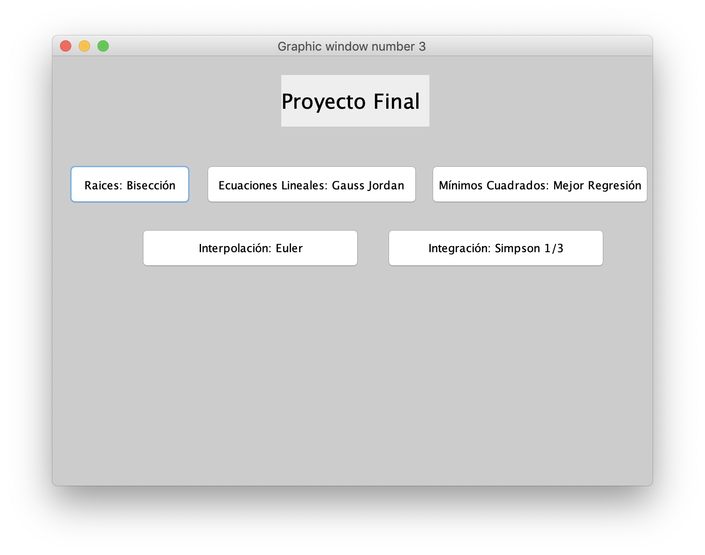
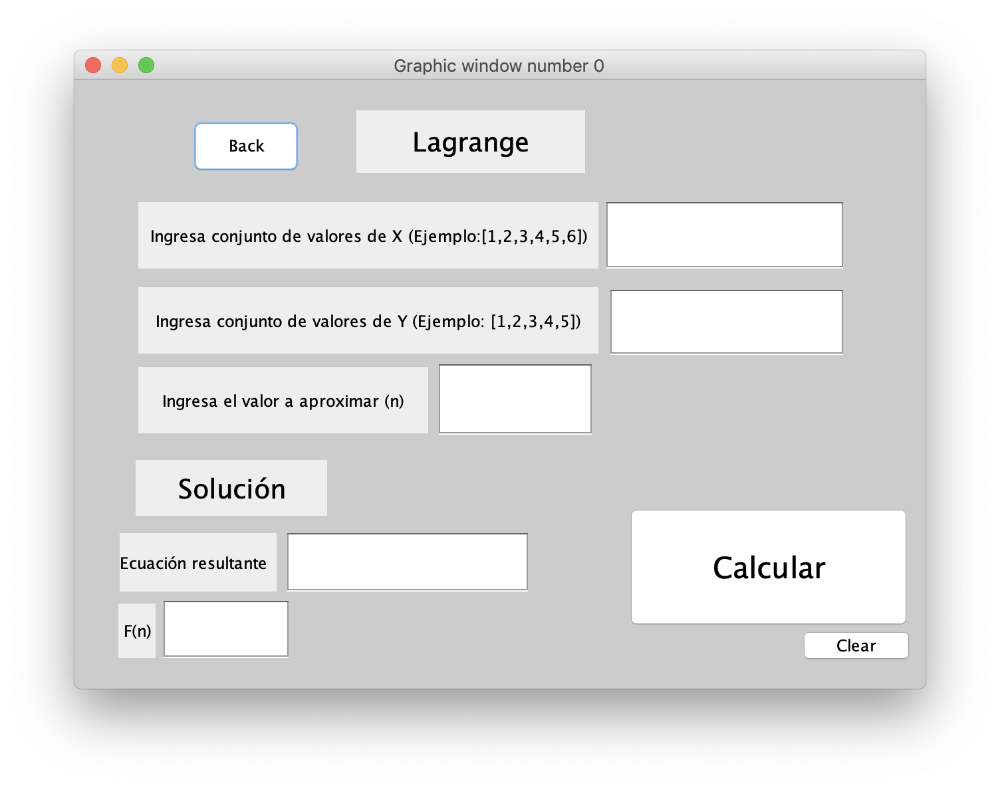
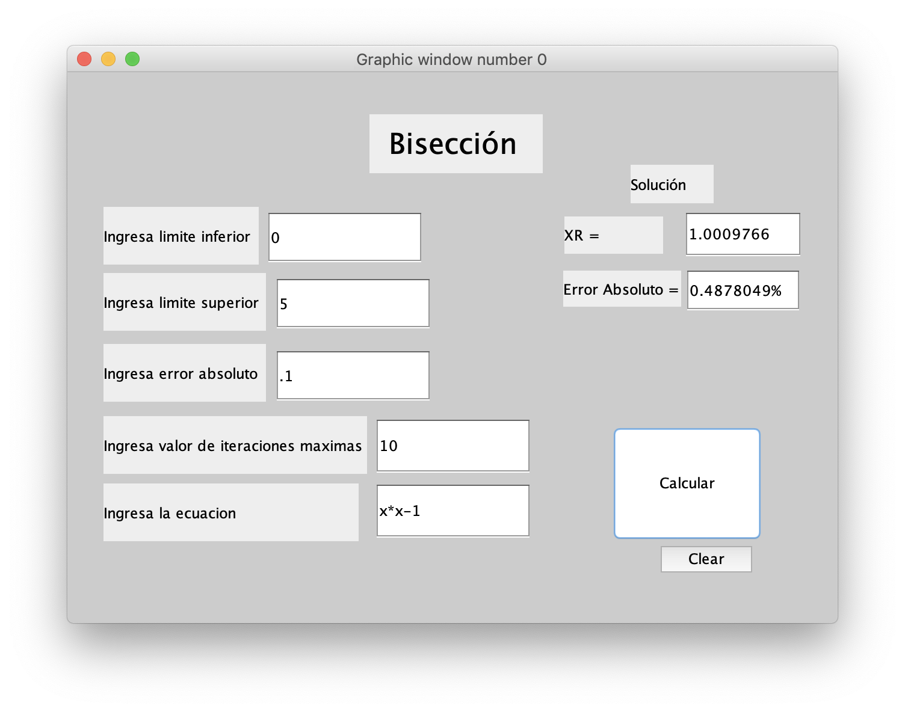

# **Final Project Numerical Methods**

## *Description:*

For our final project of our numerical methods class we were asked to create a program in Scilab that should have a graphic interface letting the user solve different type of problems with the 5 methods that we saw during the semester which are: 

* **Bisection**
* **Gauss Jordan**
* **Linear Regression**
* **Lagrange**
* **Simpson 1/3**

## Usage:

- In order to use our program you should first install Scilab on your computer from the website: https://www.scilab.org/.
- Once you download the file "Proyecto Metodos Terminado.zip" unzip it to get the folder "Proyecto Metodos Terminado" and move the folder to your current working directory in **Scilab**.
- Finally open scilab and run the program called "**MenuPrincipal.sce**"

## How to use:

- You should see the following on screen:

- You can choose between the 5 different methods that we saw on class by just clicking on a button

- Then you should see an interface like the one above with the inputs each method should have. You can fill the inputs that each method needs and to get the answer simply click on the button "**Calcular**" and the answer will be shown at the solution area. 

## Input examples:

# IMPORTANT NOTES

###*Remember when using the method "**Simpson 1/3**" you should have an even number of parabolas*

### Contributors:

- ***Rafael Ignacio Martinez Ortega***
- ***Ricardo Gabriel Ramirez Arriaga***
